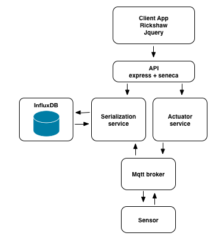
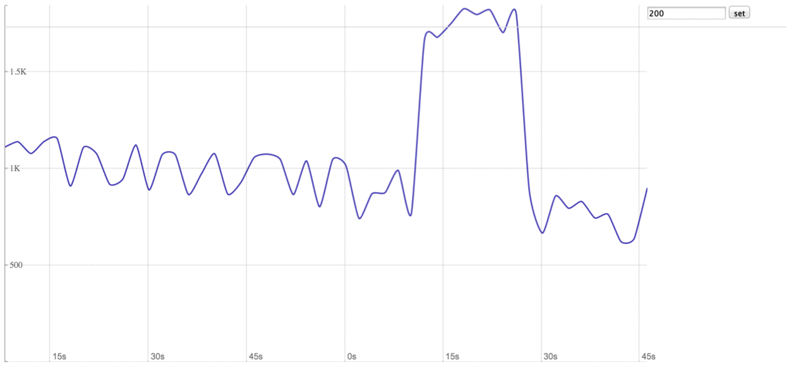

# Developing Microservices
This workshop will walk you through creating and composing a set of
microservices in node.js using fuge, docker and docker-compose.

__Note:__ This is a beginners level workshop. Whilst you should be comfortable
with node.js modules and applications and have a basic understanding of docker
and it's principles we will be helping you through the basics. This workshop presents a series of fairly simple challenges to help you get up to speed with these technologies.

## The app
The app you're building is a sensor fed chart that provides realtime
data from a dummy sensor. This 'app' is broken down into a number of
individual services, each with its own well defined concern. as outlined in this diagram



### Frontend
A simple web app that uses jQuery, Rickshaw charts, and WebSockets to show
a realtime graph of data being emitted by our sensor. This app has an API
which is included in the same microservice who's sole job is to talk to
and read from other microservices.

### Actuator
A small microservice that causes reads on the sensor based on an offset.

### Sensor
A dummy temperature sensor that sends out varying values based on what it
receives from the actuator.

### Serialisation
A service that handles reads and writes in serial fashion to the database. Uses
websocket-stream to update the web app and thus the graph, in real time.

### Broker
A robust messaging layer build for IoT based devices. We use this to wire up
the actuator, serialiser and sensor in a loosely coupled fashion.

### Influx
A database in a container that the serialiser uses for robust storage of data.

Once we have built the application it shoud look a bit like this:



## The libraries

The system uses the following libraries and technologies:

### Rickshaw Charts
A charting library for the web.

http://code.shutterstock.com/rickshaw/

### hapi
A HTTP Web server library.

http://hapijs.com/

### websocket-stream
A web socket streams implementation for realtime communication to the browser.

https://www.npmjs.com/package/websocket-stream

### browserify
A module to let you require modules client side by bundling up dependencies.

http://browserify.org/

### Seneca
A Microservices library

http://senecajs.org/

### Mosca / MQTT
An MQTT broker that enables robust message, particularly suited to IoT.

https://github.com/mcollina/mosca

### InfluxDB
A time series database particularly suited to time sensitive data.

https://influxdb.com/

### Fuge
A microservice development environment

https://github.com/apparatus/fuge

### Docker
A container engine.

https://www.docker.com

## Setting up
To complete this workshop you will need node.js and some supporting tools installed on your laptop along with a working docker installation with an InfluxDB image.

You should follow the instruction for each component to get set up:

### node.js
Go to https://nodejs.org/en/ and download and install the latest stable build for your system.

### fuge
Once you have installed node.js fuge may be installed by running:
```
npm install -g fuge
```

### Docker
Go to https://www.docker.com/products/docker-toolbox and download and install the latest stable verions of docker toolbox for your platform.

Once you have the toolbox installed, start the default machine: `docker-machine start default`

Set your shells environment using: `eval "$(docker-machine env default)"`

Confirm that all is well by running: `docker ps`

This tutorial uses a docker [influx db container](https://hub.docker.com/r/tutum/influxdb/) you should pull this container using the following command:

```
docker pull tutum/influxdb
```

you should also pull a node.jd container using:

```
docker pull node
```

Once you have the following complete its time to move to step0

### Workshop
You should clone this repository to your local machine:

```
git clone git@github.com:nearform/micro-services-tutorial-iot.git
```

You should then setup the repository by installing required node modules:

```
cd micro-services-tutorial-iot
npm install
```

## Next Up [step0](./step0/README.md)

## Need Help
We are as ever your humble servants and happy to take any questions:

- [@matteocollina](https://twitter.com/matteocollina)
- [@pelger](https://twitter.com/pelger)
- [@mcdonnelldean](https://twitter.com/mcdonnelldean)
- [@davidmarkclem](https://twitter.com/davidmarkclem)
- [@wpreul](https://twitter.com/wpreul)

[Docker Cheat Sheet]: https://github.com/wsargent/docker-cheat-sheet
