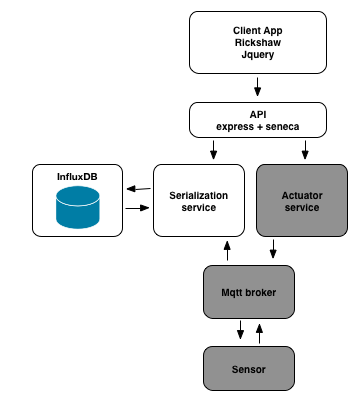

# Step 2

## solution to step 1

1. The influx container can be started with the script provided in step2/services/influx
2. The folder step2/services/serailizer contains the code for the serialization service
2. Start this service with the script step2/services/serializer/run.sh
3. Send some test data using the script step2/services/serializer/testWrite.sh
4. use the influx console to view data points

__note__ The serializer code is a seneca micro-service. Seneca provides an abstraction layer over various transport mechanisms including TCP, HTTP, RabbitMQ, Redis, NATS, etc... In this tutorial we are using HTTP as the transport mechanism and sending JSON based messages.

## Challenge

The next thing we will need to do is to hook up our front end to our serialization service in order to read data values for charting.

An updated front end that talks to the serialization service is provided in step2/frontend.

Your challenge is to start up influxDB, the frontend and the serialization service. To do this you will need to write a startup script for the frontend service in the same way as the serialization service.

Once you have these up and running use the testWrite.sh script to send data to influx and see it appear in the front end.

__hint__ If you look at the updated frontend code you will see that it uses the follwing environment variables

* PROXY_HOST
* serializer_PORT
* frontend_PORT

Your script will need to set these values prior to starting the frontend.

## Next Up [step3](../step3/README.md)
