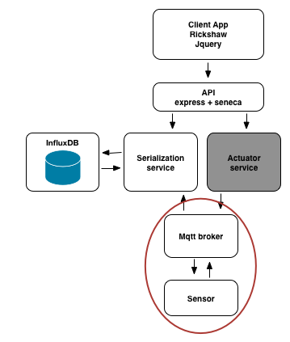

# Step 4

## solution to step 3

1. the folder step4/fuge contains configuration files for the fuge shell
2. start fuge up by running `fuge shell fuge/compose-dev.yml`
3. start the system in the shell by running `start all`
4. open http://localhost:10001 to view the chart
5. use the script step4/services/serializer/testWrite.sh to send some data to the serialization service

__note__ Fuge is now running a mixture of processes and docker containers. It does this by:

* injecting environment variables into each process
* running an internal proxy to bridge network connections between processes and containers

## Challenge

Now that we have our serializer service running, lets add in the dummy sensor and
our MQTT broker. The code for the sensor is in step4/services/sensor and for the
broker in step4/services/broker.

Your challenge is to add this into the fuge yml file and get the system running.
Once you do this you should be able to start the front end, influx and your
microservices from the fuge shell and see data streaming from the sensor to the
front end.

## Next Up [step5](../step5/README.md)
